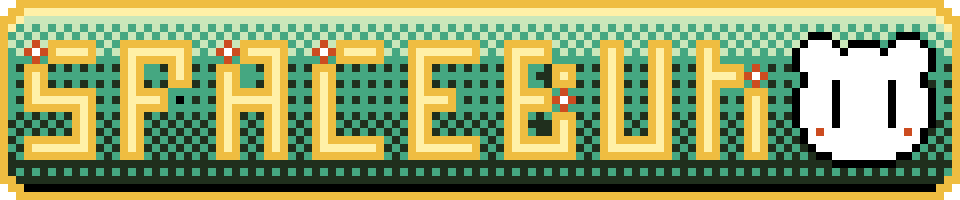

# Onboarding Sprint 2
###### Wow Much Color! *static white noise

## Q & A

- What is something you wish you could do but currently do not have the coding skills to accomplish?
> Write a full HTML Document from memory. As of right now I find myself frequently googling/ using w3 reference for tags/ html elements. While I know memorizing every HTML tag is a huge undertaking. My goal is obtain enough knowlegde to write a basic HTML Doc. from memory. Using and understanding basic HTML fundimentals such as:  
> `<meta> <html> <a> <ul> <audio> <iframe> <script> ` To name a few.
- What are you struggling with?
> While I feel like I have a basic understanding of CSS, I feel I have only scratched the surface of HTML and could greatly benefit from taking more time to study how html elements affact one another and how semantic HTML can be more affectivly used to create a better user experence.
- How do you solve a problem? 
> Cry... A lot.
> I start with a google search, then w3, and when all else fails Stock Overflow. That's a joke. I don't use Stock Overflow.
- What methods do you use to help yourself get unstuck?
> It helps to first break down the problem. Understand what it is I am trying to accomplish. Then retrace my steps right before the problem occurs. From there, for me, it is a matter of troubleshooting/ diagnosing what the actual error or problem is. EX: 
> - Is this a syntax or spelling error?
> - Are there forces outside of the scope, that could be affecting this issue?
> - Am I following the principles of being a Pragmatic Programmer?
> - Cry
> - Use Stock Overflow

---
## Art Things I did!
###### Hey these look like minecraft flowers! *beep boop

If you take a look at the images on this blog post you see they all have something in common. They use the same color palette! 
> What's cool about the color palette? 

It was created using a new <em>technique</em> I found to generate limited color palettes. `Blog Coming Soon!` 
> It's probably easy to tell that I enjoy making 8-bit art. One of the cool aspects of making 8-bit art is you can limit yourself to certain color paletts ranging anywhere from 2 colors to &#8734; !

I won't *git* into how I made the pallete in this blog. But for those who wish to know more and who wish to even create art with this palette. You can download the 8-color Palette here: [Download Pallete](https://lospec.com/palette-list/eddie-munson#comment-23238)
### BUT WAIT! Stranger Things Season 4 Spolier Alert!
If you don't wish to see any ST4 spoliers here's a download link to gimp file (GPL) color palette. 
[GPL Color Pallete Download](https://lospec.com/palette-list/eddie-munson.gpl)

