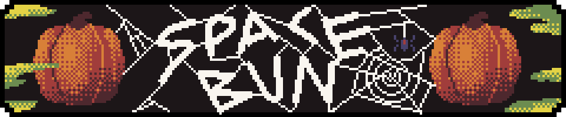
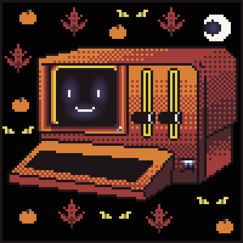

###### ITS SPOOKIE SEASON! BEEP BOO!

## Creative Writing
How did the week go? Pretty good I'd say, felt like I learned alot and made sure to put in a couple extra hours to help get a stretch goal done. Took a break during the weekend and managed to get in some much needed rest and family time. 

I've been spending alot of time thinking about what I would like to get out of bootcamp. I've also been thinking alot about how I would like to spend my time after. Is seeking employment the right path for me, or will I find greater fulfillment following another path? Don't get me wrong, jobs provide a great sense of security but working for someone else's vision never really seemed to fit me all too well, in a creative sense. I much prefer my own direction. Unless something is 110% aligned with my morals and values and allows the me the same creative freedom I've come to know from being self-employed.

Autumn is coming in, making the hot summer nights much cooler. The leaves are slowly showing signs of turning. This is my favorite time of the year. With the excitement of the holidays and seasonal coffees bring a extra sense of coziness to the chilly mornings, how could you not enjoy the end of a hot summer.
The smell of cinnamon, cheap halloween costumes, and patchouli scented candles. Pumkins bigger then your head, scary movies late at night, the warmth and smell of a campfire at the end of a day. 

But there is always a trade off, with the beauty this season brings it also takes away. The life of spring that seems to mature in the summer. Grows old in the fall and before we know it. The new year signals the end of this years festivites and achievements, but also the beginning of a melancholic stillness. Life and beauty goes dormant and the quiet months reminds us why Spring, Summer and Fall are so special. 

Much like the fall the process of changing is more fun then the end goal.

## Q & A 
1. What did you learn about that helped you understand the development process?
    > What State is and how it can be used to manage the UI and backend of a web app program. 
2. What does it mean to develop good code?
    > It doesn't have to be the most efficient program ever made, as long as it is functional and well thought out. There is always going to be someone with more experience that can teach you a better method/ way of doing something, as with life.
3. What does it mean to be a good developer?
    > Staying humble and open to ideas and methods, to always be learning and improving.
4. What is one thing that programmers hate doing?
    > Repeating themselves.

