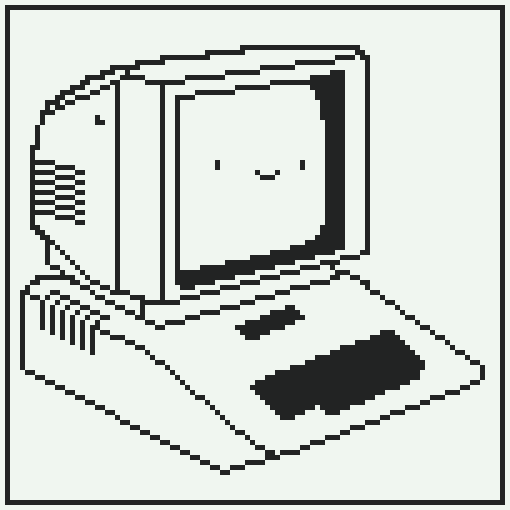
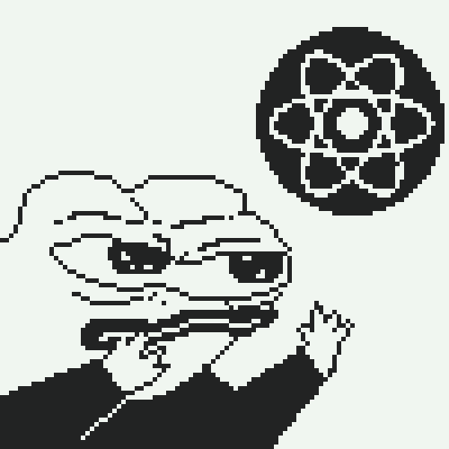
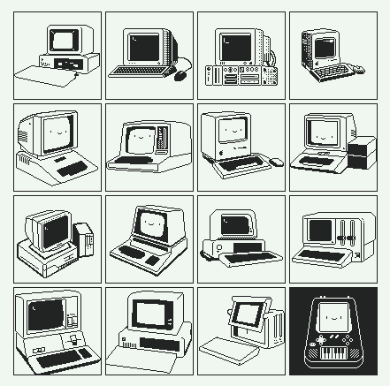

---
# SpaceBun Blog Space 

## List of Blogs Links Below

1. Onboarding Sprint 1
    - [Aug 26, 2022](blogPosts/OnboardingSprint1.md)
2. Onboarding Sprint 2
    - [Sep 2, 2022](blogPosts/OnboardingSprint2.md)
3. Onboarding Sprint 3
    - [Sep 9, 2022](blogPosts/OnboardingSprint3.md)
4. Onboarding Sprint 4
    - [Sep 16, 2022](blogPosts/OnboardingSprint4.md)
5. Sprint 1, HTML, CSS, JS, State
    - [Sep 22, 2022](blogPosts/Sprint1-HTML%2CCSS%2CJS%2CState.md)
 
 
---

[Bookmark Links](stand_alone/Bookmarks.md)
[Warm Ups Repo](https://github.com/bootcamp-students/f22-warmups)

---

###### This blog was created by SPACE BUN (๑╹ᆺ╹) 

<!-- ###### Bee boo boo bop *Old puter noises 
 -->


<!-- ## Q & A 
- Was your first week what you expected? Why? Why not?<br />
    > A lot of reading for sure, and definitely a struggle to manage time and learning with the given time frame. But not so bad.<br /><br />
    
- What are you excited or eager to learn more about?<br />
    > I'm most excited to learn about JS Framework React, to me that was the main incentive to join AwesomeInk's Bootcamp. My goal is to understand and develop artistic and dynamic webpages for users to enjoy.<br /><br />

- What is something about you that can only be learned by reading this blog?<br />
    > I make music, sometimes.<br /><br />

<br />

###### Friendly Froggy Frend


<br />
<h3>This is the CSS code I wrote to style my markdown page.</h3>
<br />

 ```
 <style type="text/css">

body {
    font-family: monospace;
    background-color: #f0f6f0;
    color: #222323;
    font-size: 20px;
}
 img {
    border: 5px solid black;
} 

</style>
```
<h3> I also wrote a handful of HTML tags EX.</h3>

```
<br />
<br />
<h3>This is the CSS code I wrote to style my markdown page.</h3>
```
<h3>Git Commands used to Update GitHub from GitPod</h3>

```
git add [filename]
git commit -m "description of changes"
git push
```
###### More 8-bit puter art (๑╹ᆺ╹) 


<style type="text/css">

body {
    font-family: monospace !important; 
    background-color: #f0f6f0;
    color: #222323;
    font-size: 20px;
}
 img {
    border: 5px solid black;
} 

</style>


 -->
